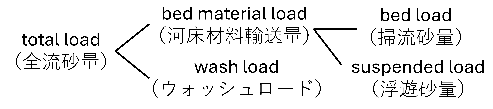
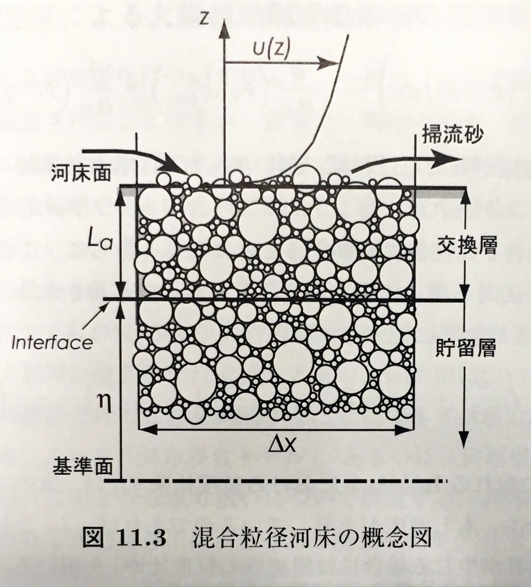

# 土砂水理基礎講座

---

  - [はじめに1](#はじめに1)
  - [はじめに2](#はじめに2)
  - [河床上の土砂移動](#河床上の土砂移動)
    - [摩擦速度とは？](#摩擦速度とは)
    - [河床上の土砂移動](#河床上の土砂移動-1)
    - [メモ：河床粗度と土砂移動の関係](#メモ河床粗度と土砂移動の関係)
    - [メモ：摩擦速度と土砂移動の向きは同じか](#メモ摩擦速度と土砂移動の向きは同じか)

  - [水中の土砂移動](#水中の土砂移動)
    - [静水中の土粒子の沈降速度](#静水中の土粒子の沈降速度)
  - [掃流砂と浮遊砂](#掃流砂と浮遊砂)
    - [浮遊砂とは](#浮遊砂とは)
    - [水中の浮遊する土砂の運動](#水中の浮遊する土砂の運動)
    - [河床上の土粒子が浮上する機構](#河床上の土粒子が浮上する機構)
    - [メモ：河床近傍の土砂を巻き上げる渦運動](#メモ河床近傍の土砂を巻き上げる渦運動)

---

  - [土砂の移動条件](#土砂の移動条件)
    - [移動限界](#移動限界)
    - [メモ：ウォッシュロードについて](#メモウォッシュロードについて)
  - [河床変動の仕組み](#河床変動の仕組み)
    - [河床変動の基礎](#河床変動の基礎)
    - [浮遊砂を含む河床変動](#浮遊砂を含む河床変動)
    - [メモ：境界条件における平衡給砂とは？](#メモ境界条件における平衡給砂とは)
    - [メモ：動的平衡とは](#メモ動的平衡とは)
    - [メモ：「河床」がどこか問題](#メモ河床がどこか問題)

  - [混合粒径の影響](#混合粒径の影響)
    - [遮蔽効果と突出効果](#遮蔽効果と突出効果)
    - [河床材料の粒度分布](#河床材料の粒度分布)
  - [その他](#その他)
    - [メモ：粒度分布は一次データとは言い切れない](#メモ粒度分布は一次データとは言い切れない)
    - [メモ：河岸侵食とは](#メモ河岸侵食とは)
    - [メモ：礫が浮遊すると...](#メモ礫が浮遊すると)
  - [まとめ](#まとめ)
  - [参考図書](#参考図書)

---

## はじめに1

 - 出水時の土砂移動（流砂）によって河床地形は変化する（河床変動）。
 - 河床変動予測は河道の治水、利水、環境、維持管理を考える上で必要不可欠
 - 近年、河床面的地形の取得が可能になり、その重要性が高まっている。

図 二時期の面的地形の比較（[秋田2024](https://www.jstage.jst.go.jp/article/river/30/0/30_299/_pdf/-char/ja)）

---

## はじめに2

 - 土砂水理が難しい要因：水の流れのNS方程式のようなしっかりした運動方程式がない。⇒ 現象ごとに異なる式を使う必要がある（ex. 掃流砂と浮遊砂、河床波と砂州…。それぞれで支配方程式が全く異なる）。
 - いろいろな無次元量が出てくる（無次元掃流力、粒子レイノルズ数...etc）。⇒ 実験式が多くフィッティングのため無次元化、次元の調整が必要。
 - 使用する式は比較的簡単。微分方程式はほとんどない。質点系の力学で大枠を理解することができる。

**⇒ 本講義では暗記ではなく現象理解を重視します**

---

## 河床上の土砂移動

### 摩擦速度とは？

実務でもよく耳にする「摩擦速度」ですが理解していますか？

 - 摩擦ということは力？でも速度？
 - 無次元掃流力と関係するような？

---

 - せん断力$\tau_0$：水塊に潤辺に作用して抵抗力として働く力
 - 掃流力（河床せん断力）$\tau^{'}_0$ ：せん断力の反力。河床土砂を動かす力。
 - 両者はベクトル量のため流れの向きを正方向とすると $\tau^{'}_0 = -\tau_0$ となる。

出典：[山口大学講義資料](https://ds.cc.yamaguchi-u.ac.jp/~yakamats/img/riv_eng7NN.pdf)に加筆

---

せん断力$\tau_0$は、重力$W$と全せん断力$T$と用いて下式で表される(単位幅で記述)。

$$
\begin{align}
W   &= \rho_w \mathrm{g} h \ell \\
W_x &= W \sin i_b \sim W \, i_b =  \rho_w \mathrm{g} h \ell i_b \\
T &= \tau_0  \ell
\end{align}
$$

$W_x = T$より、

$$
\begin{align}
\tau_0 = \rho_w \mathrm{g} h i_b 
\end{align}
$$

ここに、$\rho_w$:水の密度， $\mathrm{g}$:重力加速度， $i_b$:河床勾配とする。

出典：[現場のための水理学](https://i-ric.org/uc/uc_products/practicalHydraulilcs/)

---

よって、掃流力（河床せん断力）$\tau^{'}_0$の大きさは、

$$
\begin{align}
|\tau^{'}_0| = |\tau_0| = |\rho_w \mathrm{g} h i_b| 
\end{align}
$$

向きは流れと同じ向きになる。

この掃流力を流速の次元で次式のように定義したものを摩擦速度$u_*$と呼ぶ。

$$
\begin{align}
u_* = \sqrt{ \tau^{'}_0 / \rho_w } = \sqrt{ \mathrm{g} h i_b }
\end{align}
$$

また、下式のとおり無次元化したものを無次元掃流力$\tau_*$と呼ぶ。

$$
\begin{align}
\tau_* =\frac{\tau^{'}_0}{\rho_w \rho_{sw} \mathrm{g} d} = \frac{u_*^2}{\rho_{sw} \mathrm{g} d} = \frac{h i_b}{\rho_{sw} d}
\end{align}
$$

ここに、$\rho_{sw} = (\rho_{s}-\rho_{w})/\rho_{w}$:砂の水中比重、$\rho_s$:砂の比重， $d$:砂の粒径とする。

*摩擦速度とは掃流力を速度の次元で表したもの。向きは流れの方向（せん断力と反対）*

---

 - なぜ、速度の次元で表すのか？
 　- （諸説あるが、）流れの中での粒子の移動速度$u_b$を掃流力の関係をわかりやすく示すため。

$$
\begin{align}
u_b = \alpha u_*
\end{align}
$$

一方で、前出のとおり力学的に考えると粒子の移動は掃流力と粒径の関数で示される。

$$
\begin{align}
% u_b = f(u_*) 
u_b = f(u_*,d) = f(\tau_*,d)
\end{align}
$$

そのため、河床変動を考える上で最も重要な水理量は、摩擦速度および無次元掃流力となる。

---

### 河床上の土砂移動

 - 河床上の土砂の運動形態として滑動（sliding），転動（rolling），躍動（salutation）がある。
 - これらの運動形態で移動する土砂を**掃流砂**と呼ぶ。
 - 掃流砂の（平均的な）移動速度は摩擦速度の関数で示される。

出典：[山口大学講義資料](https://ds.cc.yamaguchi-u.ac.jp/~yakamats/img/riv_eng7NN.pdf)に加筆

---

### メモ：河床粗度と土砂移動の関係

$i_b=i_e$として、エネルギー勾配$i_e$をマニング則で求めると、摩擦速度$u_*$は次式で表される。

$$
\begin{align}
u_* &= \sqrt{ \mathrm{g} h i_e } =  \frac{nq\sqrt{ \mathrm{g} } }{h^{7/6}}  \\ 
q &= \frac{1}{n} h^{5/3} i_e^{1/2}
\end{align}
$$

つまり、マニングの粗度係数$n$を大きくすると、摩擦速度=河床土砂を動かす力が大きくなる。

⇒ *水位調整などで粗度係数を変更することは河床の土砂移動を変化させることに留意すること*

---

### メモ：摩擦速度と土砂移動の向きは同じか

 - 一次元の時は同じ。二次元、三次元の時は考える必要がある。(局所勾配の影響)
 - 下図のように、河岸等の横断斜面上では重力の影響を受けて、摩擦速度と土砂移動（掃流砂）の向きが変わる。

出典：[「現場のための水理学」令和版](https://i-ric.org/yasu/nbook2/index.html)

---

## 水中の土砂移動

### 静水中の土粒子の沈降速度

水中の土砂移動として静水中の沈降運動を見る。 重力$F_G$，浮力$F_B$，抵抗力$F_D$のみを考慮して力の釣り合いを考えると下式となる。

$$
\begin{align}
    F_B - F_G &= - (\rho_w - \rho_s) g V \\
    F_D &= \dfrac{1}{2}\rho_w C_D A w_0^2
\end{align}
$$

粒子形状が球とすると $V=\pi d^3/6$, $A=\pi d^2/4$ であり、(終末)沈降速度$w_0$は次式で表される。

$$
w_0 = \sqrt{\dfrac{4}{3}\dfrac{gd}{C_D}\left(\dfrac{\rho_s}{\rho_w}-1\right)}
$$

---

ここに、$\rho_s$:粒子の比重， $\rho_w$:水の密度， $g$:重力加速度， $d$:粒子径， $C_D$:抗力係数とする。

ここで抗力係数$C_D$が問題となる。$C_D$は水の乱れの影響を受けて複雑に変化する。

出典：[Wu:Sediment Transport Dynamics](https://www.routledge.com/Sediment-Transport-Dynamics/Wu/p/book/9781032380285?srsltid=AfmBOooyjDvDMrUOVDpaIl721aqYmP0Jd_NB--LeE0Pb1b3WC1MTsZsx)

---

粒子レイノルズ数$Re=\dfrac{w_0 d}{\nu}$は乱れの大きさを示す。(キーワード：層流、乱流)。ここに、$\nu$:水の動粘性係数とする。

参考として、抗力係数$C_D$と粒子レイノルズ数$Re$の関係を示すが複雑である。

<!--  -->

出典：[Wu:Computational River Dynamics](https://www.routledge.com/Computational-River-Dynamics/Wu/p/book/9780415449601?srsltid=AfmBOordIsdQSZqtRwznCjqOYldoU282oxkIHz4zh1Q4X9CQmAC-yP_e)に加筆
<!--  -->

---

なので、抗力係数$C_D$の厳密な評価は諦めて実験式を用いる。

沈降速度の計算に実務で最も使われるのはRubeyの式であり、下式のように単純な形式で示される。

$$
\begin{align}
w_0 = f(d,\nu)
\end{align}
$$

動粘性係数$\nu$は水温の関数であるが概ね一定のため、粒径のみの関数と考えることができる。

⇒ *複雑な沈降運動ですが、実験式によって大まかな沈降速度を求めることができる*

***課題：Rubeyの式について***

---

## 掃流砂と浮遊砂

### 浮遊砂とは

 - 水中で移動する土砂のうち、前出で定義しした掃流砂の移動形態（滑動、転動、跳躍）以外はすべて浮遊砂と呼ぶ。

 <!-- - ある粒径の土砂が掃流砂になるか浮遊砂になるかは、流れの速度$u_b$と沈降速度$w_0$の関係で説明される。 -->

<!--  -->

出典：[Wu:Sediment Transport Dynamics](https://www.routledge.com/Sediment-Transport-Dynamics/Wu/p/book/9781032380285?srsltid=AfmBOooyjDvDMrUOVDpaIl721aqYmP0Jd_NB--LeE0Pb1b3WC1MTsZsx)

---

<!-- ### 摩擦速度と沈降速度の関係 -->

### 水中の浮遊する土砂の運動

 - 粒子の水流の作用による移動速度$u_b$を以下のように近似する。

$$
\begin{align}
u_b = \alpha u_*  \cong u_* 
\end{align}
$$

 - $u_* \gg w_0$のとき、なかなか沈まないので浮遊砂っぽい動き。
 - $u_* \ll w_0$のとき、すぐに沈んで河床上を移動するので掃流砂っぽい動き。

⇒ *摩擦速度$u_*$と沈降速度$w_0$の比が掃流砂と浮遊砂の分類の目安になりそう*

 <!-- - 浮遊砂は、粒子の沈降速度$w_0$よりも流れの速度$u_b$が大きい場合に生じる。
 - 浮遊砂は、流れの中での粒子の移動速度$u_b$は摩擦速度$u_*$と沈降速度$w_0$の関数で示される。
 - 摩擦速度$u_*$と沈降速度$w_0$の関係は、掃流砂と浮遊砂の境界条件を示す。
 - 流れの中での粒子の移動速度$u_b$は、摩擦速度$u_*$と沈降速度$w_0$の関数で示される。 -->

---

 - 十分に浮遊砂が発達した状態における土砂濃度鉛直分布は移流拡散方程式に従うことが知られており、その分布は沈降速度$w_0$/摩擦速度$u_*$の関数で示される。

出典：[河村:土砂水理学1](https://www.morikita.co.jp/books/mid/049199)に加筆

 <!-- - 一方で、前出の浮遊砂の運動を考慮すると、移流拡散方程式に従うはずが無いと感じるはず。
 ⇒ *この考えで近似できるのは浮遊砂が十分に卓越する場合のみ。微妙な浮遊砂は未解明。* -->

---

### 河床上の土粒子が浮上する機構
※少し高度な話

未だにメカニズムが十分に解明されていない。分かっていることは以下のとおり。

出典：[藤田2007口頭発表](https://www.jsce.or.jp/committee/hydraulic/kisosuiri/h19/kisosympo2007/8.pdf)又は[藤田2005](https://www.jstage.jst.go.jp/article/sabo1973/57/6/57_6_3/_pdf/-char/ja)

---

 - 水流による揚力、流れの乱れの作用で浮上する。
 - 乱れの影響は間欠性を示す。
 - 河床から巻き上がる土砂量は計測が難しいので、河床近傍（一般には水深の5%）の浮遊砂濃度（基準面濃度と呼ぶ）で評価する。 
 - 基準面濃度は摩擦速度$u_*$/沈降速度$w_0$の関数で示される。
 
⇒ よく分からないので、*河床から巻き上がる浮遊砂量は摩擦速度$u_*$/沈降速度$w_0$の関数である*ことだけ覚えておく。
※ 実務で汎用される基準面濃度式は板倉・岸の式などがある。

---

### メモ：河床近傍の土砂を巻き上げる渦運動
 - 前述のイジェクションとは渦運動の一種である。
 - （乱流全般がそうですが、）計測、解析がかなり難しい。
 - 間欠的な現象であるが、基準面濃度式では時空間平均的な取り扱いとする。

出典：[関根:移動床流れの水理学](https://www.kyoritsu-pub.co.jp/book/b10010361.html)

<!-- ---

### まとめ
 - 水流中に存在する任意の土粒子が掃流 or 浮遊は摩擦速度$u_*$と沈降速度$w_0$の関係で決まる。⇒ 粒径のみでは決まらない。
 - 掃流砂量は、摩擦速度$u_*$と粒径の関数で示される。
 - 浮遊砂の河床からの巻き上げ量は、摩擦速度$u_*$/沈降速度$w_0$の関数で示される。
 - 水中の浮遊砂の濃度分布は移流拡散方程式に従い、鉛直分布は摩擦速度$u_*$/沈降速度$w_0$の関数で示される。 -->

---

## 土砂の移動条件

### 移動限界

 - 流水中の土粒子がぎりぎり動かない状態で釣り合っている状態のことを移動限界と呼ぶ。また、移動限界を示す無次元掃流力を*限界無次元掃流力*と呼ぶ。
 - 図より土粒子が動き出す条件として、x,y方向に2つの式が得られる。
     - x方法：抗力 + 重力x成分 - 摩擦力 > 0
     - y方法：揚力 - 重力y成分 > 0

 ⇒ この式には複数の係数が含まれるので数値的に解くのは結構大変。

---

 - そのため、図のような実験結果を用いて限界無次元掃流力が求める。(シールズ図表、超メジャー)
 - 実務では、近似式である岩垣の式(図中式(2.2.30))を使うことが一般的である。

<!--  -->

出典：[河村:土砂水理学1](https://www.morikita.co.jp/books/mid/049199)に加筆

***課題：岩垣の式について***

---

### メモ：ウォッシュロードについて

 - ここで、改めて力の釣り合い式を考えると以下となる。
     - 粒径0.1~0.2mm以上はx方向の式が制約となる = 掃流砂で移動開始
     - 粒径0.1~0.2mm以下はy方向の式が制約となる = 浮遊砂で移動開始

 ⇒ 前出では摩擦速度/沈降速度で掃流砂と浮遊砂の分類が決まると述べたが、停止か浮遊かしかない粒径が存在する。= ウォッシュロードと呼ばれる

出典：[Wu:Sediment Transport Dynamics](https://www.routledge.com/Sediment-Transport-Dynamics/Wu/p/book/9781032380285?srsltid=AfmBOooyjDvDMrUOVDpaIl721aqYmP0Jd_NB--LeE0Pb1b3WC1MTsZsx)

---

 - ウォッシュロードは、実務上は浮遊砂と同様の取り扱いとする。
 - 一方で、物性値は0.1~0.2mm以上の粒径のものと異なるため、浮遊砂と分離して表記することが多い。

 - ウォッシュロードの運動は未解明な点も多く、評価が難しい。(高濃度流、空隙率、堆積機構、凝集、...etc)

---

## 河床変動の仕組み

### 河床変動の基礎

まずは掃流砂のみを考慮すると、河床の質量保存則（エクスナーの式）のみで表現される非常にシンプルなモデル。

$$
\begin{align}
B(1-\lambda)\frac{\partial z_b}{\partial t} + \frac{\partial Q_s }{\partial x} = 0
\end{align}
$$

ここに、$z_b$:河床高，$B$:川幅，$Q_s$:掃流砂量， $\lambda$:河床の空隙率とする。

つまり、コントロールボリュームの流砂量の差が河床変動を決定する。

出典：[水山ら（1997）](https://www.jstage.jst.go.jp/article/sabo1973/50/1/50_1_67/_pdf/-char/ja)

---

### 浮遊砂を含む河床変動

次に浮遊砂を考慮すると、河床の質量保存則（エクスナーの式）は次式となる。

$$
\begin{align}
B(1-\lambda)\frac{\partial z_b}{\partial t} + \frac{\partial Q_b }{\partial x} + B(q_{su}-w_0 c_b)= 0
\end{align}
$$

ここに、$q_{su}$:浮遊砂の巻き上げ量， $w_0$:沈降速度，$c_b$:浮遊砂の底面濃度とする。

ここで$c_b$が問題となる。流水中の濃度は上流からの供給される濃度によって決まるため、移流拡散方程式を解いて濃度を求める必要がある。

出典：[水理公式集2018](https://www.jsce.or.jp/publication/detail/detail.asp?id=3126)

---

### メモ：境界条件における平衡給砂とは？

 - 河床変動の上流端境界条件として、平衡給砂を設定することが多い。
 - 掃流砂における平衡給砂は、上流端の河床高が変化しないように流砂量を設定する方法である。=　掃流砂は移動速度が小さく、上流からの給砂量の粒径がその場の河床材料と同じと考えてんも問題がない。
 - 一方、浮遊砂は移動速度が大きく、その場に存在しない粒径の土砂が上流から供給される可能性が高い。 = 平衡給砂が定義できない。 = 何らかの土砂濃度を与える必要がある。

---

### メモ：動的平衡とは

 - 前出の図において、掃流砂量$Q_{b1}$と$Q_{b2}$が等しい状態 = 流砂は存在するが河床変動が生じない状態を動的平衡と呼ぶ。
 - 河川環境や維持管理の観点で理想的な状態とされている。

※浮遊砂が多い河川での動的平衡は複数の説があるが、現時点では存在し得ないという説が有力

<iframe width="560" height="315" src="https://www.youtube.com/embed/RJxOI0uUIAw?si=IIBMHxHDIlHaazuf" title="YouTube video player" frameborder="0" allow="accelerometer; autoplay; clipboard-write; encrypted-media; gyroscope; picture-in-picture; web-share" referrerpolicy="strict-origin-when-cross-origin" allowfullscreen></iframe>

---

動的平衡状態の実例：固定砂州（⇔（移動）砂州）
 - 砂州に植生が繁茂していないのはなぜか？

例：太田川（左：2008年、右：1961-69年）

<iframe
    width="800"
    height="400"
    src="https://maps.gsi.go.jp/?hc=hic#15/34.508077/132.482532/&ls=ort%7Cseamlessphoto%7Cnendophoto2008&blend=0&disp=001&vs=c1j0h0k0l0u0t0z0r0s1m0f0&vs2=f0&sync=1&ls2=std%7Cort_old10&blend2=0&disp2=11"
    frameborder="0"
    allowfullscreen
></iframe>

※ 通常の砂州は移動しながら動的平衡状態を維持する（難しいので今回は省略）。

---

### メモ：「河床」がどこか問題
 - 移動床では河床は表層には土砂が活発に動く薄い層（掃流砂層と呼ばれる）が存在する。
 - 河床変動計算では、便宜的に掃流砂層が非常に薄いと考えて、掃流砂層の上端を河床と定義している。
 - 厳密な検討では、河床の位置は重要であり、何らかの理論を設けて定義する必要がある。

出典：[関根:移動床流れの水理学](https://www.kyoritsu-pub.co.jp/book/b10010361.html)

---

## 混合粒径の影響
 - 実河川では河床土砂は様々な大きさの粒度で構成されている。
 - 混合粒径の土砂移動は未解明な点が多い。現時点では単一粒径のフレームワークを基本に若干の変更を加えることで対応している。

出典：[SULAIMAN(2007)](https://repository.kulib.kyoto-u.ac.jp/dspace/bitstream/2433/73290/1/a50b0p64.pdf)

---

### 遮蔽効果と突出効果

 - 遮蔽効果と突出効果を考慮することにより限界無次元掃流力を補正する。
     - 遮蔽効果は平均粒径より小さい土砂が動きにくくなる効果である。
     - 突出効果は平均粒径より大きい土砂が動きやすくなる効果である。

<!--  -->

※実務上は修正エギアザロフの式を用いることが多い。

---

### 河床材料の粒度分布

 - 河床材料の粒度分布を考慮するため、交換層モデル（平野モデル）と呼ばれる概念モデルを使用する。

※実務では交換層モデルを拡張した交換層-遷移層-堆積層モデル（芦田、江頭、劉モデル）を使用することが多い

出典：[関根:移動床流れの水理学](https://www.kyoritsu-pub.co.jp/book/b10010361.html)

---

## その他

### メモ：粒度分布は一次データとは言い切れない
 - 調査結果なので一次データっぽいが、人為的判断（調査手法）の影響が大きく、純粋な一次データとは言い切れない。その要因は、調査手法の選択や複数の分析結果の合成方法などにある。
    - 問題：細粒分が多すぎる、大粒径が含まれないなど

出典：[山本:沖積河川－構造と動態－](https://gihodobooks.sslserve.jp/book/1758-4.html)

---

 - 容積法
   - 最も一般的な方法。ふるい分け法。コストは高いが精度も高い。
   - 参考：[ユーエルアクアティクス㈱HP](https://ulaqua.com/blog/%e3%83%a6%e3%83%bc%e3%82%a8%e3%83%ab%e3%82%a2%e3%82%af%e3%82%a2%e3%83%86%e3%82%a3%e3%82%af%e3%82%b9/)

- 線格子法、面格子法
  - ふるいが使えないほどの大粒径の河床材料の分析に使用。コストは低いが精度も低い。
  - 参考：[国総研資料](https://www.nilim.go.jp/lab/bcg/siryou/tnn/tnn0521pdf/ks052108.pdf#page=22)

- 沈降分析
   - 前出のStokes領域で適用可能。一般的には0.075mm以下の粒径で使われる。高コスト。
   - 参考：[日本総合試験所HP](https://www.gbrc.or.jp/assets/test_series/documents/so_04.pdf)

---

### メモ：河岸侵食とは
 - 河床変動のようだが力学は全く異なる。
 - 河岸前面の河床の侵食の進行によって引き起こされる。

出典：[後藤ら（2001）](https://www.jstage.jst.go.jp/article/jscej1984/2001/684/2001_684_35/_pdf)

※河床変動計算で取り扱う場合はモデル化が必要

---

### メモ：礫が浮遊すると...
 - ここまでの説明は、流砂が水流に影響を与えないことを前提としている。
 - 礫が浮遊するような土砂流、土石流ではその限りでは無く、これまでの説明は適用できない。

出典：[江頭（2024）口頭発表](https://committees.jsce.or.jp/hydraulic/system/files/20240312%E6%B1%9F%E9%A0%AD%E5%85%88%E7%94%9F.pdf)

---

## まとめ
 - 摩擦速度$u_*$は河床に作用する掃流力を表す。
 - 土砂の運動形態が掃流砂になるか浮遊砂になるかは摩擦速度$u_*$と沈降速度$w_0$の比で決まる。
 - 掃流砂量は摩擦速度$u_*$と粒径の関数で示される。
 - 河床からの巻き上げ量と水中の土砂濃度分布は、摩擦速度$u_*$と沈降速度$w_0$の関数で示される。
 - 土砂が移動するかどうかは限界無次元掃流力で決まる。
 - 動き出したらすぐに浮遊するウォッシュロードと呼ばれる粒径が存在する。

---

 - ここまで質点系の考え方で説明を進めてきたが、実は流砂量式も質量保存則も連続体？？？

***課題：掃流砂量式について***

---

## 参考図書

 - 初級：[現場のための水理学](https://i-ric.org/uc/uc_products/practicalHydraulilcs/)
 - 中級：[関根:移動床流れの水理学](https://www.kyoritsu-pub.co.jp/book/b10010361.html)
 - 上級：[河村:土砂水理学1](https://www.morikita.co.jp/books/mid/049199)
 - 数値計算特化型：[山地河川における河床変動の数値計算法](https://www.amazon.co.jp/dp/4381013638?tag=maftracking422714-22&linkCode=ure&creative=6339)(絶版)