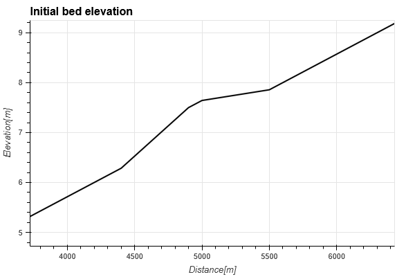

# 一次元河床変動計算のコーディング：掃流砂、単一粒径

---

## 目次

  - [はじめに](#はじめに)
  - [河床変動計算の計算手順](#河床変動計算の計算手順)
  - [流れの計算](#流れの計算)
  - [流砂量の計算](#流砂量の計算)
  - [河床高の計算](#河床高の計算)
  - [$\Delta t$の設定：CFL条件](#delta-tの設定cfl条件)
  - [侵食制限の取り扱い](#侵食制限の取り扱い)
  - [本手法の適用限界](#本手法の適用限界)
  - [コーティング例](#コーティング例)

---

## はじめに

 - 河床変動計算では、流水によって生じる河床土砂の移動に伴う河床高の時間変化を示している。そのため、非定常（時間発展）の計算が必要となる。
 - 前回講義のとおり、河床変動計算は考慮すべき内容が多く複雑ではあるため、ポイントのみを端的に説明する。
 - 今回は、掃流砂のみ単一粒径の河床変動計算を対象とする。

---

## 河床変動計算の計算手順

河床変動計算では、1回の時間ステップの中で以下の計算を実施する。

1. 流れの計算
   - 流量（or 流速）、水位（or 水深、河積）の更新
2. 流砂量の計算
   - 水理量より流砂量を更新
3. 河床高の計算
   - 流砂量より河床高を更新

これらを任意の時間まで繰り返すことにより、河床変動を計算する。

流れの計算は1.のみであるため、いくつかの工程が増える。

---

各計算の変数は以下のようになる。

1. 流れの計算
     - 式：連続式、運動方程式
     - 入力変数：流量（or 流速）、水位（or 水深、河積）、***河床高***
     - 出力変数：流量（or 流速）、水位（or 水深、河積）
2. 流砂量の計算
     - 式：流砂量式
     - 入力変数：流量（or 流速）、水位（or 水深、河積）⇒ 無次元掃流力
     - 出力変数：流砂量
3. 河床高の計算
     - 式：河床の質量保存則
     - 入力変数：流砂量、河床高
     - 出力変数：河床高

---

 - 1.において、河床高が変数となる。(流れのみの計算との違い)
 - 2.微分方程式ではなくシンプルな線形式。離散化等は必要ない。
 - 3.で更新した河床高を次の時間ステップの流れの計算に使用する。
    - 河床変動の結果が流れに影響を与えるのは河床高のみ

---

## 流れの計算

 - 今回のサンプルコードでは不等流計算（単位幅流量）を用いている。

$$
\begin{align}
& \dfrac{d}{dx}\left( \frac{q^2}{2gh^2} + h + z_b \right) = -i_e \\
& q = \dfrac{1}{n}i_e^{1/2}h^{5/3} \\
\end{align}
$$

ここに、$q$：単位幅流量、$h$：水深、$z_b$：河床高、$i_e$：エネルギー勾配、$n$：マニングの粗度係数、$g$：重力加速度とする。

$$
\begin{align}
\left(\frac{q^2|^{n+1}}{2gh^2|^{n+1}_i} + h|^{n+1}_i + {z_b}|^n_i \right) 
-\left( \frac{q^2|^{n+1}}{2gh^2|^{n+1}_{i-1}} + h|^{n+1}_{i-1} + {z_b}|^{n}_{i-1} \right) 
= \dfrac{1}{2}\left(\dfrac{q^2|^{n+1}n^2}{h^{10/3}|^{n+1}_i} + \dfrac{q^2|^{n+1}n^2}{h^{10/3}|^{n+1}_{i-1}}\right)\Delta x
\end{align}
$$

なお、$i$:上流側、$i-1$:下流側とする。また、$n$：時間ステップを示す。

---

 - 河床高$z_b$はn（前の時間ステップ）時点の値を使用する。
 - 河床変動計算の流れの計算はロバストであることが重要。
    - 河床変動計算が止まる原因の大半は流れの計算である。河床変動によって流れが不安定になり発散することがほとんど。
    - そのため、発散しにくい流れの計算手法を選ぶことが重要である。
    - 後述する不等流計算でも発散しにくい離散化手法を用いている。
 - より高精度で解析する場合、不定流計算を用いるが、ロバスト性の高い離散化手法を選択する必要がある。

---

## 流砂量の計算

 - 今回のサンプルコードでは掃流砂量式として芦田・道上式を用いている。

$$
\begin{align}
 \frac{q_b}{\sqrt{\rho_{sw} g d^3}} &= 17 \tau_{*e}^{3/2}\left(1-\frac{\tau_{* c}}{\tau_*}\right)\left(1-\sqrt{\frac{\tau_{* c}}{\tau_*}}\right) \\
 \tau_{* e} &= \frac{u_{*e}^2}{\rho_{sw} g d} \\
\dfrac{V}{u_{*e}} &= \dfrac{1}{\kappa}\log_e{\dfrac{h}{k_s}} - \dfrac{1}{\kappa} + A_r   \\
k_s &=  d(1+2\tau_*) \\
\kappa &= 0.4 , A_r = 8.5 \\
\end{align}
$$

ここに、$q_b$：掃流砂量、$\rho_{sw}$：砂の水中比重、$d$：(平均)粒径、$\tau_{*e}$：有効無次元掃流力、$\tau_{*c}$：無次元限界掃流力、$\tau_*$：無次元掃流力、$V$：水深平均流速、$h$：水深を示す。

---
 - 本式は微分方程式ではないので、離散化は必要ない。変数の代入のみ。
 - 本式は、$\tau_{*} > \tau_{*c}$の場合に成立し、それ以外の場合は0となる。
 - $\tau_{*c}$は岩垣の式で算出する。砂礫の場合は0.05。
 - 有効摩擦速度$u_{*e}$の計算式が少し複雑である。変な値にならないように注意する必要がある。

---

## 河床高の計算
 - 今回のサンプルコードでは前回提示した河床の質量保存則を単位幅の式形で用いている。

$$
\begin{align}
(1-\lambda)\frac{\partial z_b}{\partial t} + \frac{\partial q_b }{\partial x} = 0
\end{align}
$$

ここに、$z_b$:河床高，$q_b$:掃流砂量， $\lambda$:河床の空隙率とする。

$$
\begin{align}
z_b|^{n+1}_{i} = z_b|^{n}_{i} - \dfrac{\Delta t}{(1-\lambda)}\frac{q_b|^{n+1}_{i+1/2} -q_b|^{n+1}_{i-1/2}  }{\Delta x} = 0 
\end{align}
$$

なお、$i+1/2$:下流側、$i-1/2$:上流側とする。また、$n$:時間ステップを示す。

---

 - 本式の離散式では上流から順にインデックスを付けることが一般的である。
   - 不定流計算も同様。不等流計算が特殊
 - 流砂量はセルセンター$(i)$でのみ定義されているため、ハーフセル$(i+1/2)$での流砂量を求める必要がある。今回は風上化によって求めている。
   - 流砂量の向きを考慮して、風下側（上流側）の流砂量をハーフセルの値として用いる。

出典：[水理公式集2018](https://www.jsce.or.jp/publication/detail/detail.asp?id=3126)に加筆

---

## $\Delta t$の設定：CFL条件

 河床の連続式における$\Delta t$をどのように決定するかを考える。

 - 流れの計算（不定流計算）におけるCFL条件は以下となる。
     - 左辺を右辺に移行した式形をクーラン数と呼ぶ。
$$
\begin{align}
\frac{\Delta x}{\Delta t}>|U|+\sqrt{g h}
\end{align}
$$

 - 流れの計算（不定流計算）におけるCFL条件は以下となる。
    - 導出は煩雑のため、参考論文（[宮本1997](https://www.jstage.jst.go.jp/article/sabo1973/50/2/50_2_61/_pdf)）を参照されたい。

$$
\begin{align}
\frac{\Delta x}{\Delta t}>\frac{\left|\partial q_B / \partial h\right|}{\left(1-F_r^2\right)(1-\lambda)}
\end{align}
$$

ところが、流れの計算のCFL条件が支配的になることが多く、本式はほとんど使用しない。

--- 

 - 数値解法の安定性を考えると、$\Delta t$は流れのCFL条件を満たしていればよいが、解法の自体の問題（後述）により、流れの計算のクーラン数と比較して小さく設定する必要がある。
 - 目安としては、クーラン数0.1～0.2以下程度か。

---

## 侵食制限の取り扱い

 - 実河川でみられる床止め工や落差工、堰なども、少しの工夫によって計算することが可能である。
 - 堆積のみを許容し、侵食を制限するような条件を設定すること計算できる。（課題）

出典：[「現場のための水理学」令和版](https://i-ric.org/yasu/nbook2/index.html)

---

## 本手法の適用限界

前回の講義でも説明したが現状の河床変動計算のフレームワークにいくつかの問題がある。代表的なものを以下の示す。

- 流れに対する河床変動の影響は河床高のみに反映
    - 流砂があろうがなかろうが、水流の運動は変わらない。
    - 流砂による水流の密度変化は考慮しない。
    - 移動床でも固定床でも粗度は変わらない。
- 河床変動が水深に対して微小であること。
    - 流れの計算ではn時点の河床高を使用しているため、$\Delta t$あたりの河床変動量は十分に小さい必要がある。
   
これらの問題に対応できるフレームワークの開発もいくつかみられるが、現時点では決定的なものはないため、計算上の工夫等で対応する。

---

## コーティング例

単位幅流量：5.0$\mathrm{m^2/s}$、マニングの粗度係数：0.02、粒径：5$\mathrm{mm}$ 河床勾配：1/700、延長10kmの水路を対象として、水路の中央付近に高さ0.5m程度のマウンドが設置された場合の5時間後の河床変動を計算する。

サンプルコードを見ながら解説します。
 - [github版](https://github.com/computational-sediment-hyd/basicsedimenthydraulicscourse/blob/main/02sample_code.ipynb)
 - [google colab版](https://colab.research.google.com/github/computational-sediment-hyd/basicsedimenthydraulicscourse/blob/main/02sample_code.ipynb)

