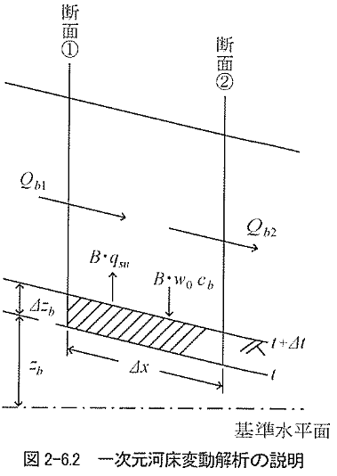

# 一次元河床変動計算のコーディング：浮遊砂、単一粒径

---

## 目次

<div class="columns">
<div>

  - [はじめに](#はじめに)
  - [浮遊砂を含む河床の連続式（再記）](#浮遊砂を含む河床の連続式再記)
  - [浮遊砂濃度の連続式](#浮遊砂濃度の連続式)
  - [メモ：土砂濃度の表記について](#メモ土砂濃度の表記について)
  - [沈降量の評価](#沈降量の評価)
  - [巻き上げ量の評価](#巻き上げ量の評価)
    - [板倉・岸の式](#板倉岸の式)
  - [メモ：平衡流砂量について](#メモ平衡流砂量について)
  - [浮遊砂の河床変動計算の計算手順](#浮遊砂の河床変動計算の計算手順)

</div>
<div>

  - [計算手順：巻き上げ量](#計算手順巻き上げ量)
  - [計算手順：沈降量、浮遊砂濃度](#計算手順沈降量浮遊砂濃度)
  - [計算手順：河床高](#計算手順河床高)
  - [コーティング例](#コーティング例)

</div>
</div>

---

## はじめに

 - 今回は、浮遊砂のみ単一粒径の河床変動計算を対象とする。
 - 河床変動計算の枠組みは前回の掃流砂の場合と概ね同様である。
 - 一方で、支配方程式や考え方はかなり煩雑になるため、ポイントのみに絞って端的に説明する（それでも難しい）。
 - 初回講義では浮遊砂に関して説明が不足していたため補足する。
 - 講義が聞いた後ももやっとするところが多いと思うが、実際に手を動かしてみることで理解が深まると思うので、サンプルコードを実行してみてほしい。

---

## 浮遊砂を含む河床の連続式（再記）

河床の連続式は次式となる（矩形近似）。

$$
\begin{align}
(1-\lambda)\frac{\partial z_b}{\partial t} + \frac{\partial q_b }{\partial x} + (q_{su}-w_0 c_b)= 0
\end{align}
$$

ここに、$q_{su}$:浮遊砂の巻き上げ量， $w_0$:沈降速度，$c_b$:浮遊砂の底面濃度とする。

今回は掃流砂は考慮せずに浮遊砂のみを対象とする。

ここで示す巻き上げ量、沈降量は流水中の土砂との交換によって決まる。



出典：[水理公式集2018](https://www.jsce.or.jp/publication/detail/detail.asp?id=3126)

---

## 浮遊砂濃度の連続式

流水中の土砂濃度は移流拡散方程式に従うため、以下のように表される。

$$
\begin{align}
    \dfrac{\partial c}{\partial t} + u\dfrac{\partial c}{\partial x} + v\dfrac{\partial c}{\partial y} + w\dfrac{\partial c}{\partial z} 
    = \dfrac{\partial }{\partial x} \left( \epsilon_{sx} \dfrac{\partial c}{\partial x} \right)
    + \dfrac{\partial }{\partial y} \left( \epsilon_{sy} \dfrac{\partial c}{\partial y} \right)
    + \dfrac{\partial }{\partial z} \left( \epsilon_{sz} \dfrac{\partial c}{\partial z} \right)
    + w_0 \dfrac{\partial c}{\partial z} 
\end{align}
$$

ここに、$c$:濃度、$w_0$:沈降速度、$\epsilon_{s}$:浮遊砂の拡散係数を示す。

一次元計算で取り扱う場合、水深平均した以下のような式形となる。

$$
\frac{\partial \bar{c}}{\partial t} + u \frac{\partial \bar{c}}{\partial x} +
    \frac{w_0 \cdot c_b}{h} =
\epsilon_{sx} \frac{\partial^2 \bar{c}}{\partial x^2} + \frac{q_{su}}{h}
$$
ここに、$\bar{c}$:水深平均濃度、$h$:水深、$u$:流速、$q_{su}$:浮遊砂の巻き上げ量を示す。

前出の河床の連続式と比較すると、河床と流水間で巻き上げ量$q_{su}$と沈降量$w_0c_b$によって、土砂の交換が生じることがわかる。

---

## メモ：土砂濃度の表記について

河床変動計算では一般的に体積濃度を用いる。

$$
\begin{align}
c = \dfrac{Q_s}{Q}
\end{align}
$$

ここに、$c$：体積濃度、$Q_s$：浮遊砂量、$Q$：流量を示す。

質量濃度$c'$との関係は以下のようになる。(例としてppmを用いる)

$$
\begin{align}
c[\mathrm{ppm}]=1000 \times c'[\mathrm{g/l}] / \rho_{s}
\end{align}
$$

ここに、$\rho_{s}$：土砂の密度(2.65$\mathrm{g/cm^3}=2650\mathrm{kg/m^3}$)を示す。

現地調査、模型実験等との比較の際は注意が必要である。

---

## 沈降量の評価

沈降量は$w_0c_b$で示されるが、$c_b$:基準面濃度が問題となる。
$c_b$の算出方法を以下に示す。式導出の詳細は参考書(例えば、[河村:土砂水理学1](https://www.morikita.co.jp/books/mid/049199))参照

前出の濃度の連続式で等流を仮定すると以下の式が得られる。

$$
\begin{align}
     \dfrac{\partial }{\partial z} \left( \epsilon_{sz} \dfrac{\partial C}{\partial z} \right)
    + w_0 \dfrac{\partial C}{\partial z}  = 0
\end{align}
$$

本式を変数分離して基準点の高さ$a(=0.05h)$から水面まで積分すると以下となる。

$$
\begin{align}
     \dfrac{C}{C_a} = \mathrm{exp} \left( - \int^z_a \dfrac{w_0}{\epsilon_{sz}} dz \right)
\end{align}
$$

ここで、$\epsilon_{sz}$:浮遊砂の拡散係数を評価する必要がある。

---

$\epsilon_{sz}$:浮遊砂の拡散係数が、流水の拡散係数≒渦動粘性係数と概ね等しいと考えられている。
水の渦動粘性係数は次式で定義される。

$$
\begin{align}
     \nu_{tz} = u_* \kappa z \left(1-\dfrac{z}{h}\right)
\end{align}
$$

ここに、$u_*$:摩擦速度、$\kappa$:カルマン定数を示す。

本式を前出の式に代入すると以下のようになる。
$$
\begin{align}
    \dfrac{c}{c_b} &= \left( \dfrac{h-z}{z} \dfrac{a}{h-a} \right)^{\dfrac{w_0}{ \kappa u_*}} 
\end{align}
$$

本式はRouse分布と呼ばれ、土砂濃度の鉛直分布を示している(第1回講義参照)。


出典：[河村:土砂水理学1](https://www.morikita.co.jp/books/mid/049199)に加筆

---

Rouse分布は微積分がしづらいため近似式を用いることが多い。前出の渦動粘性を水深平均すると次式が得られる。

$$
\begin{align}
     \overline{\nu_{tz}} = \dfrac{1}{h} \int^h_0 u_* \kappa z \left(1-\dfrac{z}{h}\right) dz = \dfrac{1}{6} \kappa u_* h
\end{align}
$$

本式を元の濃度分布式に代入すると以下となり、Lane-Kalinske分布と呼ばれる。

$$
\begin{align}
    \dfrac{c}{c_b} &= \mathrm{exp} \left( -6\dfrac{w_0}{ \kappa u_*} \dfrac{z-a}{h} \right) 
\end{align}
$$

Rouse分布より精度は劣るが、計算が容易なため、実河川の計算等では用いることが多い。


出典：[関根:移動床流れの水理学](https://www.kyoritsu-pub.co.jp/book/b10010361.html)

---

さらに、Lane-Kalinske分布を水深積分すると以下となる。
なお、水深積分において基準面の位置$a=0.05h$を0と近似する。

$$
\begin{align}
    \overline{c} &= \dfrac{1}{h} \int^h_{0} c \, dz \\
         &= c_b \dfrac{1 - e^{-A}}{A} \\

         A &= \dfrac{h w_0}{\overline{\nu_{tz}}} \\
\end{align}
$$

本式が水深平均濃度と基準面濃度の関係式となる。よって、沈降量は$w_0c_b$で示される。

$$
\begin{align}
    w_0 c_b = w_0 \cdot \dfrac{A}{1 - e^{-A}} \cdot \overline{c}
\end{align}
$$

浅水流近似モデルでは本式を用いる。


---

## 巻き上げ量の評価

第1回講義で示したとおり、浮遊砂の巻き上げ機構は非常に複雑である。そのため、まずは平衡状態、つまり、巻き上げ量 = 沈降量の状態を考える。

$$
\begin{align}
    q_{su} = w_0 c_{be}
\end{align}
$$

上記が成立する基準面濃度$c_{be}$を求めることにより、巻き上げ量を評価することができることとする。
この、基準面濃度$c_{be}$あるいは巻き上げ量$q_{su}$を求める式は多くの半理論式、実験式が提案されているが、決定的なものはない。ここでは、実務でよく用いられる板倉・岸の式を示す。


出典：[関根:移動床流れの水理学](https://www.kyoritsu-pub.co.jp/book/b10010361.html)

---

### 板倉・岸の式

煩雑なので理解しなくても良い。

$$
\begin{align}
    c_b &= K \left( \dfrac{\alpha_*}{1+\rho_{sw}} \dfrac{u_*}{w_0} \dfrac{\Omega}{\tau_*}-1 \right) \\
    \Omega &= \dfrac{\tau_*}{B_*} \dfrac{\displaystyle \int^\infty_{a'} \xi \dfrac{1}{\sqrt{\pi}}  e^{-\xi^2} d\xi}
    {\displaystyle \int^\infty_{a'}  \dfrac{1}{\sqrt{\pi}}  e^{-\xi^2} d\xi} 
     + \dfrac{\tau_*}{B_* \eta_0} -1  \\
     a' &= \dfrac{B_*}{\tau_*} - \dfrac{1}{\eta_0}
\end{align}
$$

ここに、$\alpha_*=0.14,B_*=0.143,\eta_0=0.5,K=0.0018$とする。

---

$$
\begin{align}
    \int^\infty_{a'} \xi \dfrac{1}{\sqrt{\pi}} e^{-\xi^2} d\xi &= \dfrac{1}{ 2\sqrt{\pi}} e^{-a'^2} \\
    \int^\infty_{a'}  \dfrac{1}{\sqrt{\pi}} e^{-\xi^2} d\xi &= \dfrac{1}{2} (1-\mathrm{erf}(a')) = \dfrac{1}{2} \mathrm{erfc}(a')
\end{align}
$$

ここに、$\mathrm{erf}$:誤差関数, $\mathrm{erfc}$:相補誤差関数である。

---


## メモ：平衡流砂量について


 - ここまでに示した一般的な流砂量式は平衡流砂量式と呼ばれ、動的平衡条件で導かれたものである。
   - 動的平衡とは、掃流砂はコントロールボリュームの流入=流出、浮遊砂は巻き上げ量=沈降量を示す。
 - そのため、河床変動が生じる場合に平衡流砂量式が適用できるのかと疑問を持つかもしれないが、大半の河床変動現象では大局的には問題ないことがわかっている。
 - 一方で、流砂量が急加速、減速する、つまり、$\dfrac{\partial u_*}{\partial t}$や $\dfrac{\partial \tau_*}{\partial t}$ が、支配的な現象では非平衡性が強くなり、平衡流砂量式の適用外となる。

 ---

 - 代表的な現象として、構造物周りの局所洗掘が挙げられる。
 - 非平衡流砂量式は、格段に理論が煩雑になるため、本講義では説明は避けるが、平衡流砂量式では計算できないことが理解しておいてほしい。


出典：[河川を横過する橋梁に関する計画の手引き(案)](https://www.jice.or.jp/cms/kokudo/pdf/reports/autonomy/river/autonomy_kasen_02.pdf)

---

## 浮遊砂の河床変動計算の計算手順

1回の時間ステップの中で以下の計算を実施する。

1. 流れの計算（掃流砂と同様のため省略）
2. 巻き上げ量の計算
   - 水理量より巻き上げ量を計算
2. 沈降量の計算
   - 水理量と濃度分布より沈降量を計算
3. 浮遊砂濃度の計算
   - 巻き上げ量、沈降量より濃度を更新
3. 河床高の計算
   - 巻き上げ量、沈降量より河床高を更新

これらを任意の時間まで繰り返すことにより、河床変動を計算する。


---

## 計算手順：巻き上げ量
   - 式：板倉・岸の式
   - 入力変数：流量（or 流速）、水位（or 水深、河積）⇒ 無次元掃流力、沈降速度
   - 離散化は不要のため、変数の代入のみ。水理量は、時間発展させた値n+1を用いる。 

$$
\begin{align}
    c_b &= K \left( \dfrac{\alpha_*}{1+\rho_{sw}} \dfrac{u_*}{w_0} \dfrac{\Omega}{\tau_*}-1 \right) \\
    \Omega &= \dfrac{\tau_*}{B_*} \dfrac{\displaystyle \int^\infty_{a'} \xi \dfrac{1}{\sqrt{\pi}}  e^{-\xi^2} d\xi}
    {\displaystyle \int^\infty_{a'}  \dfrac{1}{\sqrt{\pi}}  e^{-\xi^2} d\xi} 
     + \dfrac{\tau_*}{B_* \eta_0} -1  \\
     a' &= \dfrac{B_*}{\tau_*} - \dfrac{1}{\eta_0}
\end{align}
$$

---

```python
def caKishiKuroki(us, taus, w0, K = 0.0018, rhosw = float(1.65)):
    alfa = 0.14
    Bs = 0.143
    eta = 0.5
    
    def omega(taus):
        aprime = Bs/taus - 1.0/eta
        c1 = 0.5 / np.sqrt(np.pi) * np.exp(-aprime**2) 
        c2 = 0.5 * erfc(aprime)
        
        if c2 <= 0.0 :
            rr = 0.0
        else:
            rr =taus/Bs*c1/c2+ taus/Bs/eta - 1.0
        
        return rr 
    
    r = K*( alfa/(rhosw+1)*us/w0*omega(taus)/taus - 1.0 )
    
    return 0.0 if r < 0.0 else r
```


---


## 計算手順：沈降量、浮遊砂濃度

沈降量、浮遊砂濃度は連立して計算する。前出の沈降量の式を濃度の連続式に代入すると次式が得られる。

$$
\begin{align}
    w_0 c_b &= w_0 \cdot \dfrac{A}{1 - e^{-A}} \cdot \overline{c} \\
\frac{\partial \bar{c}}{\partial t} + u \frac{\partial \bar{c}}{\partial x} +
    \frac{w_0 \cdot c_b}{h} &=
\epsilon_{sx} \frac{\partial^2 \bar{c}}{\partial x^2} + \frac{q_{su}}{h} \\
\frac{\partial \bar{c}}{\partial t} + u \frac{\partial \bar{c}}{\partial x} +
    \frac{w_0 \cdot \overline{c}}{h} \dfrac{A}{1 - e^{-A}} &=
\epsilon_{sx} \frac{\partial^2 \bar{c}}{\partial x^2} + \frac{q_{su}}{h} \\
\end{align}
$$

本講義では近似的に拡散項および時間発展の項を無視した下式を用いる。

$$
\begin{align}
 q \frac{\partial \bar{c}}{\partial x} +
    w_0 \cdot \overline{c}\cdot \dfrac{A}{1 - e^{-A}} &= q_{su} \\
\end{align}
$$

---

 - 離散化は後退差分法（一つ上流側の断面からその断面を計算する）を用いる。

$$
\begin{align}
 & \frac{q_i \overline{c}_i^{n+1} - q_{i-1} \overline{c}_{i-1}^{n+1}}{\Delta x} + w_0 \cdot \dfrac{A}{1 - e^{-A}} \overline{c}|_i^{n+1} = q_{su} |_i^{n+1} \\
&  \overline{c}_i^{n+1} = \dfrac{q_{i-1} \overline{c}_{i-1}^{n+1} + \Delta x \cdot q_{su}}{q_{i} + \Delta x \cdot w_0 \cdot \dfrac{A}{1 - e^{-A}}} \\
& A = \left. \dfrac{h w_0}{\overline{\nu_{tz}}} \right|_{i}^{n+1}, \,\,  \left. \overline{\nu_{tz}} = \dfrac{1}{6} \kappa u_* h \right|_{i}^{n+1}
\end{align}
$$

 - 離散化における留意点は巻き上げ量、沈降量に係る項は時間発展させた値n+1を用いること。

- 入力変数：流量（or 流速）、水位（or 水深、河積）⇒ 摩擦速度、沈降速度、巻き上げ量
  

---

 上流端は平衡状態（巻き上げ=沈降）として濃度を設定

```python
def calConcentration(q, h, w0, manning, Erosion, dx, g=float(9.8)):
    kappa=0.4 # カルマン定数
    c = np.zeros(len(Erosion)) 
    Deposition = np.zeros(len(Erosion)) 

    # 上端端境界 : 平衡状態
    i = 0
    us = np.sqrt(g)*manning*q/h[i]**(7/6) # 摩擦速度
    epsilon = kappa*us*h[i]/6.0
    A =  w0*h[i]/epsilon
    c[i] = Erosion[i]/w0/A*(1.0-np.exp(-A))
    Deposition[i] = Erosion[i]

    for i in range(1, len(c)):
        us = np.sqrt(g)*manning*q/h[i]**(7/6) # 摩擦速度
        epsilon = kappa*us*h[i]/6.0
        A =  w0*h[i]/epsilon
        c[i] = (q*c[i-1] + dx*Erosion[i])/(q + dx*w0*A/(1.0-np.exp(-A)))
        if c[i] < 0.0:print('濃度が負になりました', c[i], 'i=', i)
        Deposition[i] = w0*c[i]*A/(1.0-np.exp(-A))

    return c, Deposition
```


---

## 計算手順：河床高

前出の河床の連続式を示す。

$$
\begin{align}
(1-\lambda)\frac{\partial z_b}{\partial t}  + (q_{su}-w_0 c_b)= 0
\end{align}
$$

離散化は以下のように示される。

$$
\begin{align}
z_b|^{n+1}_{i} = z_b|^{n}_{i} - \dfrac{\Delta t}{(1-\lambda)}(q_{su}|_i^{n+1}-w_0 c_b|_i^{n+1}) 
\end{align}
$$

すでに算出されているn+1時点の巻き上げ量$q_{su}$、沈降量$w_0 c_b$を用いて河床高を更新する。

---

 - 巻き上げ量をErosion、沈降量をDepositionと定義している。
 - 掃流砂量(=0)も含んでいる。

```python
def calzb(zb, qbhfp, Erosion, Deposition, dx, dt, porosity=0.4):
    # 河床の連続式を計算
    dzb = np.zeros(len(zb)) 
    for i in range(len(zb)):
        dzb[i] = - dt / (1.0 - porosity) * ( qbhfp[i+1] - qbhfp[i] )/dx \
                 - dt / (1.0 - porosity) * ( Erosion[i] - Deposition[i] )

    zb += dzb #zbの更新
    return zb, dzb
```

---


## コーティング例

単位幅流量：5.0$\mathrm{m^2/s}$、マニングの粗度係数：0.02、粒径：0.1$\mathrm{mm}$ 河床勾配：1/700、延長10kmの水路を対象として、水路の中央付近に高さ0.5m程度のマウンドが設置された場合の1時間後の河床変動を計算する。なお、上流端が巻き上げ量と沈降量が等しくなるように濃度設定する。


サンプルコードを見ながら解説します。
 - [GitHub版](https://github.com/computational-sediment-hyd/basicsedimenthydraulicscourse/blob/main/03sample_code_matplotlib.ipynb)
 - [Google Colab版](https://colab.research.google.com/github/computational-sediment-hyd/basicsedimenthydraulicscourse/blob/main/03sample_code_matplotlib.ipynb)


